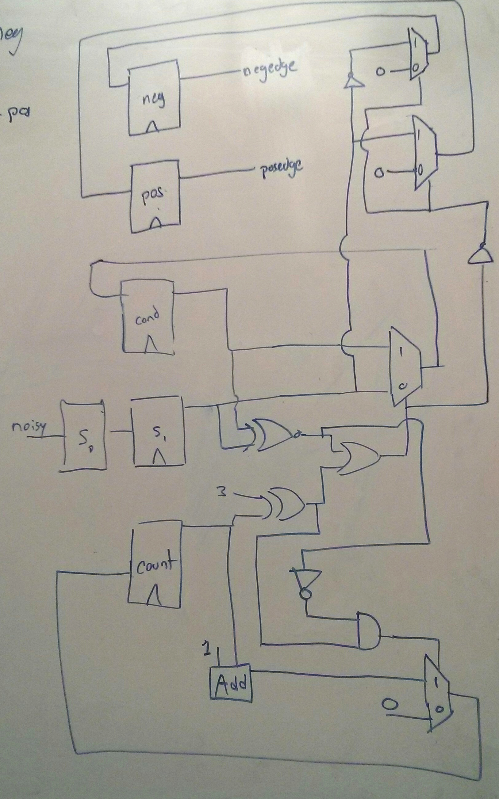

### CompArch Lab 2 Writeup
###### Isaac Getto, Sarah Walters, Patrick Huston
###### 11.06.2015

#### Input Conditioning
1. Circuit diagram

    Shown below is our circuit diagram implementation for the input conditioning unit.
    

2. Clock Analysis
"If the main system clock is running at 50MHz, what is the maximum length input glitch that will be suppressed by this design for a waittime of 10?"

In the analysis of the case that the clock is running at 50MHz, the maximum length input glitch that will still be suppressed by the design for a waittime of 10 will be 259 'time units'.

The analysis for this answer is as follows:

Maximum of 3 clock cycles = 60 time units to pass data from noisysignal to synchronizer1
plus 10 additional clock cycles = 200 time units to increment counter from 0 to 10.

This is a maximum delay of 260 time units during which noisysignal must be held constant. Therefore, noisysignal can hold a value for up to 259 time units (under the correct conditions) and will never pass through to the conditioned signal.

#### Shift Register
###### Testing Strategy
To test our shift register unit, we tested each of its use cases - serial data load, parallel data load, serial data read, and parallel data read. 

We did this by initially loading in an 8-bit number (10000000) into the shift register in parallel, triggering a clock edge to load the data into the shift register, and then verifying that the parallel data out from the shift register matched the data we originally sent in.

To test the serial load and read cases, we loaded an extra bit of data in serial, shifting the contents of the register to be '00000001'. At this point, we read the entire set of data out in parallel and in serial, verifying that the output was as expected - '00000001' for the parallel read, and '0' for the serial read.

Finally, we tested the functionality of the peripheral clock edge by setting the 'peripheralClkEdge' parameter to 0, and triggering another clock edge. If the 'peripheralClkEdge' were nonfunctional, another bit of data would have been loaded in serial into the shift register. We verified the output by checking for the same values - '00000001' for the parallel data read, and '0' for the serial read.

#### SPI Memory Testing Strategy
To test the SPI module, we iterated through all 2^7 addresses supported, and wrote twice the address value to that address. At this point, we read the values at each of the addresses written to, and ensured the value read matched the expected value that was written.

#### Fault Injection
Our injectable failure mode is that the 'synchronizer1' signal of the input conditioner module is always low if the fault pin is active. This could happen if the d flip-flop labeled S1 in the schematic of the input conditioner low were broken during manufacturing. We simulated this defect by ANDing NOT(FaultInjection) and the noisysignal input into the d flip-flop S1. 

Because the input conditioner module is fundamental to the function of the SPI memory, every test case should fail when fault injection is enabled. When the synchronizer1 signal is always low, no signal can pass through the input conditioner, making it entirely useless.
